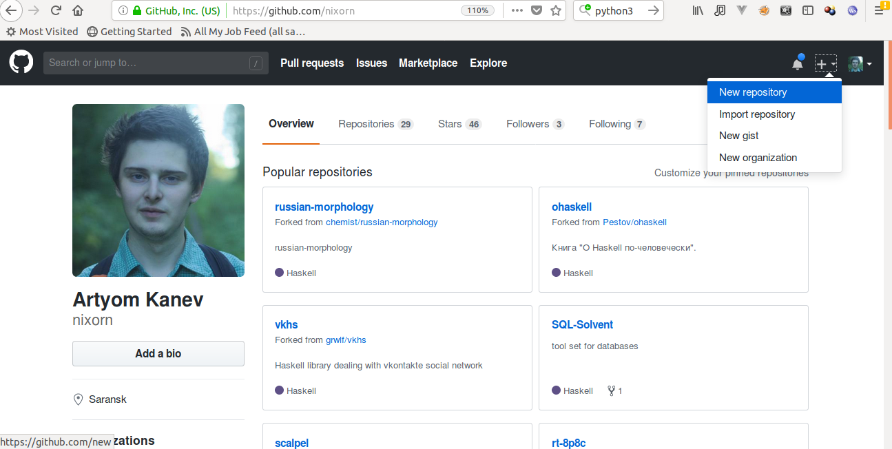
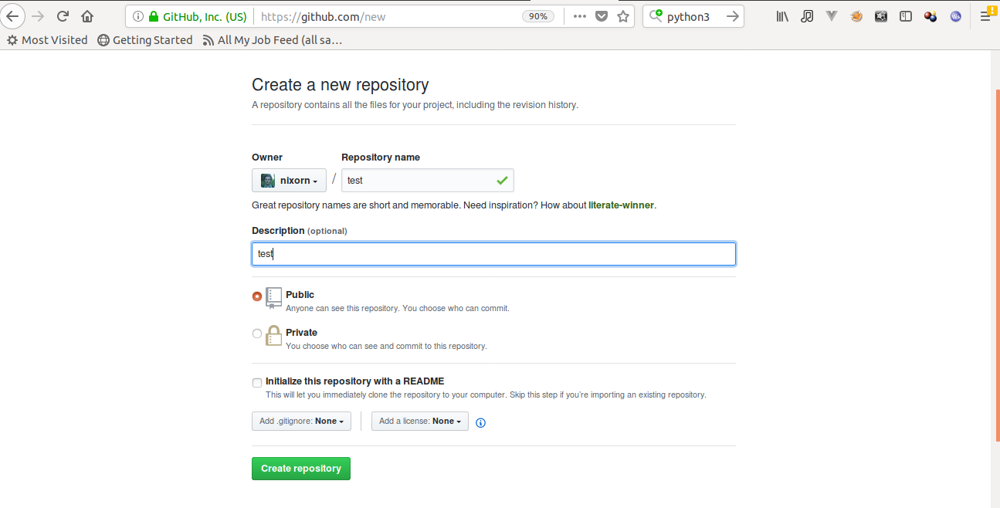
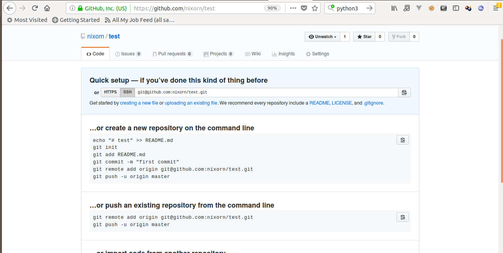
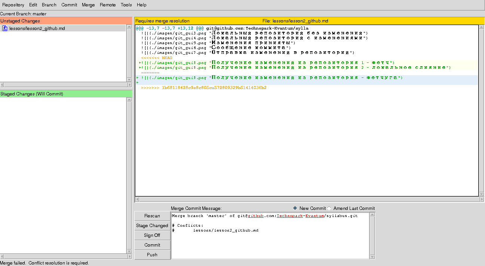

# Командная разработка

Очень тяжело создать игру в одиночку. Ну во-первых вместе веселее. Во-вторых создание топовых А+ проектов это продукт работы сотен людей разных профессий на протяжении годов. Чтобы в одну каску сделать GTA 6 не хватит жизни, а даже если ты успеешь - к тому моменту как ты закончишь, технологии уйдут далеко вперед, и никто в твое старье играть не будет. Поэтому надо объединятся.

Но работать вместе тяжело. Люди постоянно косячат, а потом ругаются. Для того чтобы не делать из командной разработки вечный мордобой придуманы специальные инструменты. Которым, к сожалению, надо учиться отдельно.

## Git и Github

Сердце мирового программирования - сайт github.com. Зарегистрируйтесь там.
Есть 

