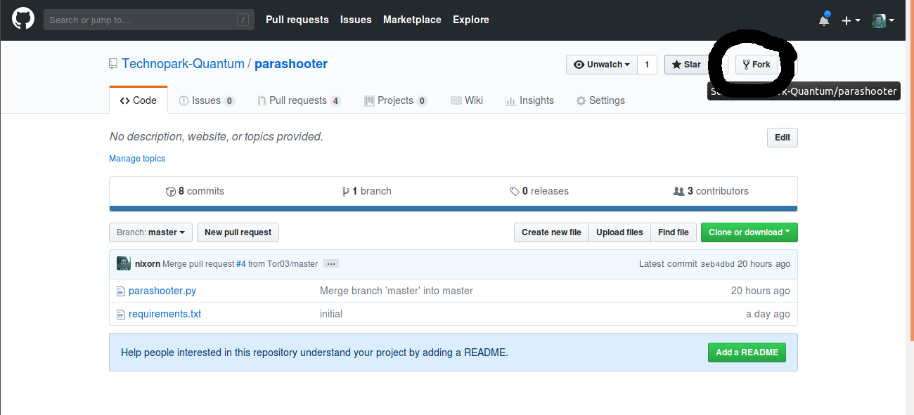

# Командная разработка

В промышленных командах игроделов используется всякое, но три вещи - железно:
1. Системы контроля версий
2. Система управления проектами
3. Месседжеры

В качестве системы контроля версий мы будем использовать git, в качестве системы управления проектами - github.com, в качестве месседжера - discord.

## Git

[Подробная книга про git, с чем его едят и как используют.](https://git-scm.com/book/ru/v2)

В кратце это система, которая позволяет очень подробно хранить историю изменений в проекте. Хранится кто и когда сделал это изменение. 


## Github.com
Регистрируемся и подтверждаем свою почту. 

Игра, которую мы делаем, лежит [тут.](https://github.com/Technopark-Quantum/parashooter)

Всем нужно форкнуть её в свой аккаунт на гитхабе. Делается это нажатием кнопки Fork и выбираением своего профиля в появившемся списке.



Самая распростаненная модель разработки в Github включает в себя три элемента:

1. Исходный репозиторий (upstream)
2. Форкнутый репозиторий в профиле разработчика на github (origin)
3. Локальная копия репозитория на компьютере разработчика (local)

Порядок участия в проекте:
1. разработчик форкает форкает интересный ему репозиторий в свой профиль
2. разработчик вносит локальные изменения на своем компьютере
3. разработчик загружает изменения на свою копию репозитория(происходит движение local -> origin)
4. разработчик создает Pull request, которым просит администрацию исходного репозитория 
5. администрация рассматривает Pull request и либо возвращает его на доработку, либо принимает решение принять изменения
6. происходит "вливание"(merge) изменений разработчика в исходный репозиторий (происходит движение origin -> upstream)
7. разработчик обновляет свой локальный репозиторий из исходного (upstream -> local)
8. далее разработка продолжается начиная с пункта 2


## Discord 
[Ссылка на чат](https://discordapp.com/invite/N8baZdd)

Регистрируемся и присоединится к этому чату. 


## Что нужно иметь к началу занятия

Обязательно:
1. Логин пароль к своему дискорду
2. Логин пароль к своему гитхабу
3. Логин пароль к почтовому ящику (или ящикам) на которые зарегистрированы ваши github и дискорд

Желательно:
1. Форкнутый [репозиторий игры](https://github.com/Technopark-Quantum/parashooter) в своем профиле на github
2. Вы присутствуете в [чате](https://discordapp.com/invite/N8baZdd)
3. Вы присутствуете в [организации.](https://github.com/Technopark-Quantum) Для того чтобы туда попасть, нужно скинуть в чат ссылку на свой профиль на гитхабе.

## Частые команды терминала, которые нам нужны

```bash
# Навигация
cd ~/Рабочий\ стол/parashooter # перейти в директорию с игрой
cd ~ # перейти в домашнюю директорию
cd .. # перейти в родительскую директорию (относительно текущей)


# Git

git status                # Узнать быструю сводку по репозиторию
git diff                  # Просмотреть изменения
git add <тут имя файла>   # Добавить файл (или изменения в файле) в репозиторий
git commit                # сохранить коммит
git commit -m "сообщение" # сохранить коммит с сообщением "сообщение", не открывать редактор
git push                  # отправить изменения на origin


git remote add upstream https://github.com/Technopark-Quantum/parashooter # Настроить upstream для локального репозитория
git pull upstream master  # Слить изменения из upstream в локальный репозиторий

```
